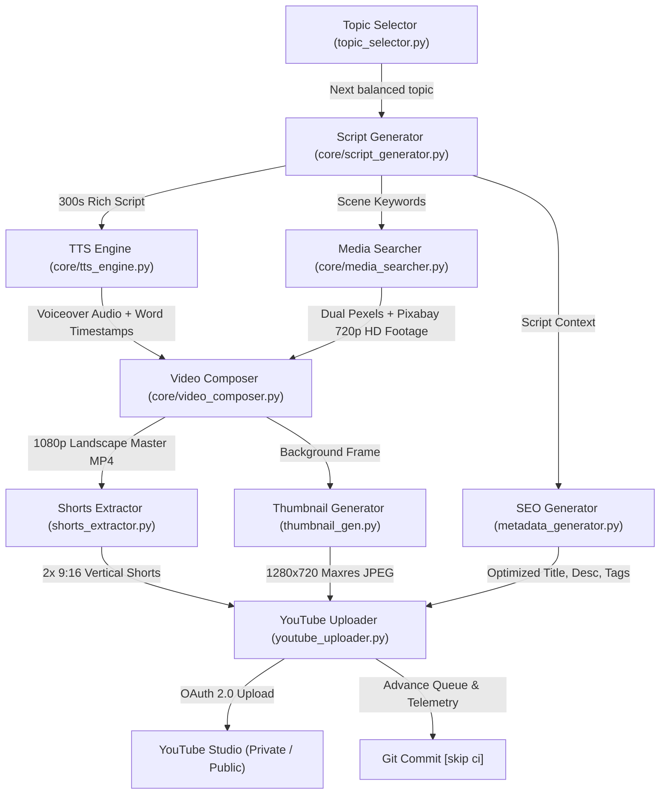

# Automated YouTube Engine — Clean New Channel Base

## 🏛️ Project State & Architecture Documentation

This document describes the engine architecture, configuration, and setup procedures for this **new channel project**.
This codebase has been cleanly decoupled from the previous project/repo. All previous video histories, queues, cached playlists, and YouTube OAuth credentials have been cleared to guarantee 100% isolation.

---

## 1. Channel Profile & Identity (Ready for Configuration)

- **Channel Name**: `[Pending User Channel Name]`
- **Channel ID**: `[Pending New Channel ID]`
- **Primary Handle**: `[Pending New Handle]`
- **Niche / Focus**: `[Pending Selection — e.g. Motivational / Mindset / Custom Flow]`
- **Narrator Persona**: Configurable via Edge-TTS (e.g. `en-US-GuyNeural`, `en-US-ChristopherNeural`, etc.)
- **Git Status**: Clean local repository, no upstream remote linked.

---

## 2. System Architecture & Component Call Graph



### Detailed Component Roles:
1. **[`pipeline.py`](file:///pipeline.py)**: Headless CLI controller orchestrating the 7 production stages with time estimation and error recovery.
2. **[`core/script_generator.py`](file:///core/script_generator.py)**: Groq API client running `llama-3.3-70b-versatile`. Produces 300-second documentary scripts broken into ~33 scenes with visual prompts and avoid-cliché instructions.
3. **[`core/tts_engine.py`](file:///core/tts_engine.py)**: Synthesizes high-fidelity voiceover and extracts millisecond word timestamps from the Edge-TTS WebSocket stream.
4. **[`core/media_searcher.py`](file:///core/media_searcher.py)**: Queries Pexels & Pixabay concurrently. Slices HD 720p landscape clips (`16:9`) and large photos using a persistent `requests.Session` with connection pooling.
5. **[`core/video_composer.py`](file:///core/video_composer.py)**: Direct FFmpeg compositor. Applies Ken Burns zoom to images, normalizes clip frame rates, ducks ambient background music, and burns in word-highlighted ASS subtitles (`Fontsize=22, MarginV=55`).
6. **[`thumbnail_gen.py`](file:///thumbnail_gen.py)**: Pillow 1280x720 graphics engine creating high-CTR thumbnails with dark contrast vignettes and bold 2-4 word badges.
7. **[`shorts_extractor.py`](file:///shorts_extractor.py)**: Analyzes scene transcript density, extracts the top 2 narrative segments (30–60s), crops to vertical 9:16 (`1080x1920`), and formats word subtitles.
8. **[`topic_selector.py`](file:///topic_selector.py)**: Rotates across 4 core categories, avoids topics covered in the last 90 days (`data/topic_history.json`), and automatically triggers Groq to brainstorm 20 fresh topics when fewer than 5 remain.
9. **[`metadata_generator.py`](file:///metadata_generator.py)**: Generates 5 rotating title patterns (Curiosity gap, List, Question, Myth-bust, Scale) and comprehensive descriptions ending with channel branding.
10. **[`youtube_uploader.py`](file:///youtube_uploader.py)**: Resumable chunked video uploader with exponential backoff, automated playlist sorting, and `containsSyntheticMedia: true` compliance disclosure.

---

## 3. GitHub Actions Automated Schedule

- **Workflow File**: [`.github/workflows/publish.yml`](file:///.github/workflows/publish.yml)
- **Schedule**: Runs automatically **2 times every day**:
  - `14:00 UTC` (7:00 PM PKT / 10:00 AM EST)
  - `22:00 UTC` (3:00 AM PKT / 6:00 PM EST)
- **Execution Environment**: Ubuntu Latest runner (`ffmpeg`, Python 3.10, system fonts).
- **Execution Speed**: **~8 minutes total runtime** for a full 5-minute video.
- **Git Sync**: Automatically commits and pushes updated topic queue and history back to repository using `[skip ci]`.

---

## 4. Quota Budget & Daily Limits

| Service | Free Tier / Daily Cap | Used Per Video | Safe Daily Capacity |
| :--- | :--- | :--- | :--- |
| **YouTube Data API v3** | 10,000 units / day | ~1,700 units (video + thumbnail + playlist) | **5 to 6 videos / day max** (3–4 is safe buffer) |
| **GitHub Actions** | 2,000 runner minutes / month | ~8 minutes | **~8 videos / day** (250 videos / month) |
| **Pexels API** | 25,000 requests / month | ~30 requests | **~25 videos / day** |
| **Pixabay API** | 100 requests / minute | ~30 requests | **Virtually unlimited** for batch schedules |
| **Groq API** | 14,400 requests / day | 2-3 requests | **Thousands of videos / day** |

---

## 5. Transitioning from Private Backlog to Public Autopilot

The system currently defaults to uploading videos as `private` to build your initial 15-video backlog in YouTube Studio.

When ready to make all future scheduled uploads go live to the public automatically:
1. Open [`.github/workflows/publish.yml`](file:///.github/workflows/publish.yml).
2. On line 90, change:
   ```yaml
   PRIVACY="${{ github.event.inputs.privacy || 'private' }}"
   ```
   to:
   ```yaml
   PRIVACY="${{ github.event.inputs.privacy || 'public' }}"
   ```
3. Commit and push. All future scheduled runs will publish as **Public**.

---

## 6. How to Set Up on a Brand-New PC

When cloning this project to a new computer:

1. **Clone the repository**:
   ```bash
   git clone https://github.com/ayubkhokhar7733/youtube-automate.git
   cd youtube-automate
   ```
2. **Install Python 3.10+ and FFmpeg**:
   - Ensure `python --version` and `ffmpeg -version` both return valid versions in your terminal.
3. **Install dependencies**:
   ```bash
   pip install -r requirements.txt
   ```
4. **Configure Local Environment (`.env`)**:
   Create a `.env` file in the project root with your credentials:
   ```env
   GROQ_API_KEY=your_groq_api_key_here
   PEXELS_API_KEY=your_pexels_api_key_here
   PIXABAY_API_KEY=your_pixabay_api_key_here
   YOUTUBE_CLIENT_ID=your_client_id.apps.googleusercontent.com
   YOUTUBE_CLIENT_SECRET=your_client_secret_here
   YOUTUBE_REFRESH_TOKEN=your_refresh_token_here
   ```
5. **Verify YouTube Connection**:
   ```bash
   py -c "import youtube_uploader; client = youtube_uploader.get_youtube_client(); res = client.channels().list(part='snippet', mine=True).execute(); print('Connected:', res['items'][0]['snippet']['title'])"
   ```
   *(Expected output: `Connected: Chronicles of Stone`)*

---

## 7. Verified Production Runs

- **Run 1 (Local Verification)**:
  - Video: *"The Antikythera Mechanism Detail Nobody Talks About"*
  - URL: [https://youtu.be/MAPl33zouPA](https://youtu.be/MAPl33zouPA)
  - Specs: 1920x1080 Landscape, 273s duration, 77.5% media download speedup verified.
- **Run 2 (Cloud GitHub Actions Verification)**:
  - Video: *"The Truth About Alien Theories at Puma Punku Is Not What You Think"*
  - URL: [https://youtu.be/zb7JUGlOxJ4](https://youtu.be/zb7JUGlOxJ4)
  - Specs: 1920x1080 Landscape, 294s duration, maxres custom thumbnail, 8m 6s cloud runtime, 100% Private.
